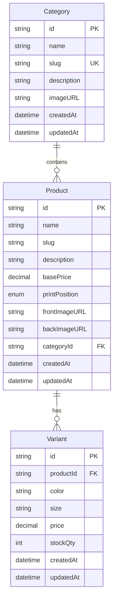

# Product, Category, and Variant Models - Implementation Plan

## Overview
This document outlines the database schema design for the e-commerce product catalog, including categories, products with print positions, and product variants (color/size combinations).

## Database Schema Design

```prisma
// PrintPosition Enum
enum PrintPosition {
  BACK
  FRONT
  BOTH
}

// Category Model - Organizes products by anime series or theme
model Category {
  id          String    @id @default(cuid())
  name        String    // e.g., "One Piece", "Naruto", "Demon Slayer"
  slug        String    @unique // SEO-friendly URL slug
  description String?   // Optional description of the category
  imageURL    String?   // Category cover image
  products    Product[] // Reverse relation: all products in this category
  createdAt   DateTime  @default(now())
  updatedAt   DateTime  @updatedAt

  @@map("categories")
}

// Product Model - Represents a hoodie design
model Product {
  id            String         @id @default(cuid())
  name          String         // e.g., "Luffy Gear 5 Hoodie"
  slug          String         // SEO-friendly URL slug
  description   String?        // Product description/details
  basePrice     Decimal        @db.Decimal(10, 2) // Base price before variant adjustments
  printPosition PrintPosition  @default(BOTH)      // Where the print appears
  frontImageURL String?        // URL to the front print design image
  backImageURL  String?        // URL to the back print design image
  category      Category       @relation(fields: [categoryId], references: [id])
  categoryId    String
  variants      Variant[]      // All color/size variants for this product
  createdAt     DateTime       @default(now())
  updatedAt     DateTime       @updatedAt

  @@unique([categoryId, slug]) // Unique slug within a category
  @@map("products")
}

// Variant Model - Color/size combinations with stock
model Variant {
  id         String   @id @default(cuid())
  product    Product  @relation(fields: [productId], references: [id], onDelete: Cascade)
  productId  String
  color      String   // e.g., "Black", "White", "Navy"
  size       String   // e.g., "S", "M", "L", "XL"
  price      Decimal  @db.Decimal(10, 2) // Variant-specific price (optional override)
  stockQty   Int      @default(0)        // Available stock for this combination
  createdAt  DateTime @default(now())
  updatedAt  DateTime @updatedAt

  @@unique([productId, color, size]) // Prevent duplicate variants
  @@map("variants")
}
```

## Relationship Diagram



## Key Design Decisions

1. **Print Position Enum**: Products can have prints on BACK, FRONT, or BOTH sides of the hoodie.

2. **Slug Fields**: Added `slug` fields for SEO-friendly URLs:
   - `Category.slug`: Unique across all categories (e.g., "one-piece", "naruto")
   - `Product.slug`: Unique within each category (e.g., "luffy-gear-5-hoodie")
   - Example URLs: `/shop/one-piece`, `/shop/one-piece/luffy-gear-5-hoodie`

2. **Category-Product Relationship**: Each Product belongs to exactly one Category (many-to-one). Categories can have many Products (one-to-many).

3. **Product-Variant Relationship**: Each Product can have multiple Variants (one-to-many). When a Product is deleted, all its Variants are automatically deleted (Cascade).

4. **Variant Uniqueness**: The unique constraint `[productId, color, size]` ensures no duplicate color/size combinations exist for the same product.

5. **Print Image**: The `imageURL` field on Product stores the URL to the print design image (separate from product photos).

6. **Pricing Strategy**: 
   - `basePrice` on Product serves as the default/base price
   - `price` on Variant allows for variant-specific pricing (e.g., different prices for different sizes if needed)

## Implementation Steps

1. Add the PrintPosition enum to the Prisma schema
2. Add the Category model
3. Add the Product model with relations to Category
4. Add the Variant model with relation to Product
5. Create and run a Prisma migration
6. Generate the Prisma client

## Sample Data Structure

```json
{
  "category": {
    "id": "cat_123",
    "name": "One Piece",
    "slug": "one-piece",
    "description": "One Piece anime merchandise",
    "imageURL": "https://example.com/one-piece-banner.jpg"
  },
  "products": [
    {
      "id": "prod_456",
      "name": "Luffy Gear 5 Hoodie",
      "slug": "luffy-gear-5-hoodie",
      "description": "Premium hoodie with Luffy Gear 5 transformation print",
      "basePrice": 79.99,
      "printPosition": "BOTH",
      "frontImageURL": "https://example.com/luffy-front-print.png",
      "backImageURL": "https://example.com/luffy-back-print.png",
      "categoryId": "cat_123",
      "variants": [
        {
          "color": "Black",
          "size": "M",
          "price": 79.99,
          "stockQty": 25
        },
        {
          "color": "White",
          "size": "L",
          "price": 79.99,
          "stockQty": 15
        }
      ]
    },
    {
      "id": "prod_789",
      "name": "Naruto Headband Hoodie",
      "slug": "naruto-headband-hoodie",
      "description": "Hoodie with Naruto village headband design on front",
      "basePrice": 69.99,
      "printPosition": "FRONT",
      "frontImageURL": "https://example.com/naruto-headband.png",
      "backImageURL": null,
      "categoryId": "cat_123",
      "variants": [
        {
          "color": "Orange",
          "size": "XL",
          "price": 69.99,
          "stockQty": 10
        }
      ]
    }
  ]
}
```

## Next Steps

- [ ] Review and approve this schema design
- [ ] Switch to Code mode to implement the changes
- [ ] Create database migration
- [ ] Update application code to use new models
- [ ] Add seed data for testing
