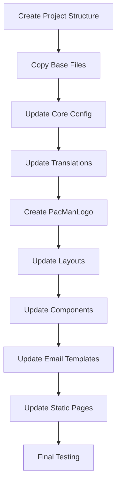

# PacMan Shop Rebranding Plan

## Overview

This plan outlines the complete rebranding of the Hoodiz e-commerce platform to create a new "PacMan" shop selling hoodies and streetwear. The new project will be created at `C:\Users\tun\Desktop\pacman`.

## Project Structure

```
C:\Users\tun\Desktop\pacman\
├── app/                      # Next.js App Router pages
├── components/               # React components
├── lib/                      # Utilities and configuration
├── translations/             # i18n translation files
├── prisma/                   # Database schema
├── public/                   # Static assets
├── i18n/                     # Internationalization config
└── Configuration files
```

## Brand Identity Changes

| Aspect | Hoodiz (Original) | PacMan (New) |
|--------|-------------------|--------------|
| **Name** | Hoodiz Tunisia | PacMan Tunisia |
| **Tagline** | Premium anime hoodies and streetwear for the culture | Premium gaming hoodies and streetwear for players |
| **Domain** | hoodiz.net | pacman.tn (placeholder) |
| **Email** | support@hoodiz.net | support@pacman.tn |
| **Theme Colors** | Purple/Pink gradient | Yellow/Blue gaming theme |
| **Logo** | Hoodiz logo | PacMan logo (needs to be provided) |

---

## Phase 1: Core Configuration Files

### 1.1 Package Configuration
**File:** `package.json`
- Change name from "hoodies" to "pacman"
- Update description with PacMan branding

### 1.2 Central Configuration
**File:** `lib/config.ts`
- Update `baseUrl` to pacman domain
- Update `logoUrl` with new logo URL
- Update `businessInfo`:
  - name: "PacMan Tunisia"
  - description: "Premium gaming hoodies and streetwear for players"
  - email: "support@pacman.tn"
  - socialLinks: Update all social media URLs

### 1.3 Environment Variables
**File:** `.env.example`
- Update all Hoodiz references to PacMan
- Update database URLs and API keys placeholders

---

## Phase 2: Translation Files

### 2.1 English Translations
**File:** `translations/en.json`

Key changes:
```json
{
  "metadata": {
    "title": "PacMan Tunisia - Premium Gaming Hoodies & Streetwear",
    "description": "Premium gaming hoodies and streetwear from Tunisia..."
  },
  "footer": {
    "brandDescription": "Premium gaming hoodies and streetwear for players.",
    "copyright": "© 2024 PacMan. All rights reserved."
  },
  "hero": {
    "badge": "New Gaming Collection",
    "titleLine1": "Wear the",
    "titleLine2": "Power of Gaming",
    "description": "Level up your style with exclusive gaming hoodies..."
  },
  "auth": {
    "loginSubtitle": "Welcome back to PacMan",
    "registerSubtitle": "Join the PacMan community"
  }
}
```

### 2.2 French Translations
**File:** `translations/fr.json`
- Mirror all English changes in French

---

## Phase 3: Logo Component

### 3.1 Create PacManLogo Component
**File:** `components/ui/pacman-logo.tsx`

Replace `HoodizLogo` with `PacManLogo`:
- Update logo URL constant
- Change alt text to "PacMan Tunisia"
- Change text display from "HOODIZ" to "PACMAN"
- Update gradient colors to gaming theme (yellow/blue)

### 3.2 Update Component Imports
Files to update:
- `components/layout/header.tsx`
- `components/layout/footer.tsx`
- `app/[lang]/admin/dashboard/layout.tsx`
- `app/[lang]/auth/page.tsx`

---

## Phase 4: Layout & Metadata

### 4.1 Root Layout
**File:** `app/layout.tsx`
```typescript
export const metadata: Metadata = {
  title: "PacMan Tunisia - Premium Gaming Hoodies & Streetwear",
  description: "Premium gaming hoodies and streetwear from Tunisia...",
  keywords: ["gaming hoodies tunisia", "streetwear tunisia", "gaming merch", ...],
  openGraph: {
    title: "PacMan Tunisia - Premium Gaming Hoodies & Streetwear",
    siteName: "PacMan Tunisia",
  },
}
```

### 4.2 SEO Component
**File:** `components/seo/seo-head.tsx`
- Update default keywords
- Update Twitter creator handle

---

## Phase 5: UI Components

### 5.1 Header Component
**File:** `components/layout/header.tsx`
- Import `PacManLogo` instead of `HoodizLogo`
- No other changes needed (uses translations)

### 5.2 Footer Component
**File:** `components/layout/footer.tsx`
- Import `PacManLogo` instead of `HoodizLogo`

### 5.3 Hero Section
**File:** `components/home/hero-section.tsx`
- Update hoodie images URLs (or keep same if using same products)
- Update alt texts for images

### 5.4 Welcome Popup
**File:** `components/welcome-popup.tsx`
- Update "Hoodies" text references to generic or keep as-is
- Update discount tier descriptions if needed

---

## Phase 6: Email Templates

### 6.1 Email Sending Route
**File:** `app/api/send-email/route.tsx`

Update all email templates:
- Welcome email: "Welcome to PacMan Tunisia!"
- Logo URL: Update to PacMan logo
- Footer text: "PacMan Tunisia - Premium Gaming Hoodies & Streetwear"
- Email from: "PacMan Tunisia <noreply@pacman.tn>"

---

## Phase 7: Static Pages

### 7.1 Privacy Page
**File:** `app/[lang]/privacy/page.tsx`
- Update support email

### 7.2 Data Export
**File:** `app/[lang]/data-export/page.tsx`
- Update export filename from "hoodie-legends-data" to "pacman-data"

### 7.3 Shop Layout
**File:** `app/[lang]/shop/layout.tsx`
- Update hardcoded descriptions

### 7.4 Product Layout
**File:** `app/[lang]/product/[categorySlug]/[productSlug]/layout.tsx`
- Update product description templates

---

## Phase 8: Files to Copy Unchanged

These files can be copied without modifications:
- All API routes (except send-email)
- All dashboard components
- All cart/checkout components
- All hooks
- Prisma schema and migrations
- Middleware
- Tailwind and PostCSS config
- TypeScript config
- All UI components (except logo)

---

## Implementation Order



---

## Files Summary

### Files Requiring Modification: ~20 files

| File | Change Type |
|------|-------------|
| `package.json` | Brand name |
| `lib/config.ts` | Business info, URLs |
| `translations/en.json` | All text content |
| `translations/fr.json` | All text content |
| `components/ui/pacman-logo.tsx` | New component |
| `app/layout.tsx` | Metadata |
| `components/layout/header.tsx` | Logo import |
| `components/layout/footer.tsx` | Logo import |
| `components/home/hero-section.tsx` | Image URLs |
| `components/welcome-popup.tsx` | Text references |
| `components/seo/seo-head.tsx` | Keywords |
| `app/api/send-email/route.tsx` | Email templates |
| `app/[lang]/privacy/page.tsx` | Email |
| `app/[lang]/data-export/page.tsx` | Filename |
| `app/[lang]/shop/layout.tsx` | Descriptions |
| `app/[lang]/product/.../layout.tsx` | Descriptions |
| `app/[lang]/admin/dashboard/layout.tsx` | Logo import |
| `app/[lang]/auth/page.tsx` | Logo import |

### Files to Copy Unchanged: ~100+ files
- All API routes (except send-email)
- All dashboard pages and components
- All cart/checkout pages
- All hooks and utilities
- Database files
- Configuration files (tailwind, tsconfig, etc.)

---

## Prerequisites

Before implementation, you need to provide:

1. **PacMan Logo URL** - The logo image hosted on Supabase or similar
2. **Domain Name** - The actual domain for the PacMan shop
3. **Social Media Links** - Facebook, Instagram, Twitter URLs
4. **Contact Information** - Email, phone, address
5. **Hero Images** - Product images for the hero section (or use existing)

---

## Next Steps

1. **Approve this plan** - Confirm the approach and file list
2. **Provide assets** - Logo URL and brand information
3. **Switch to Code mode** - Implement all changes
4. **Test thoroughly** - Verify all pages and functionality

---

## Estimated Scope

- **Configuration files:** 3 files
- **Translation files:** 2 files  
- **Component files:** ~15 files
- **Static pages:** ~5 files
- **Total modifications:** ~25 files
- **Files to copy unchanged:** ~100+ files

This is a straightforward rebranding project with no architectural changes required.
